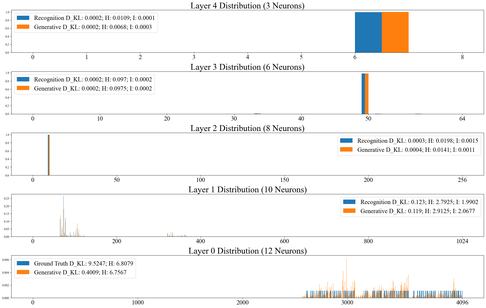
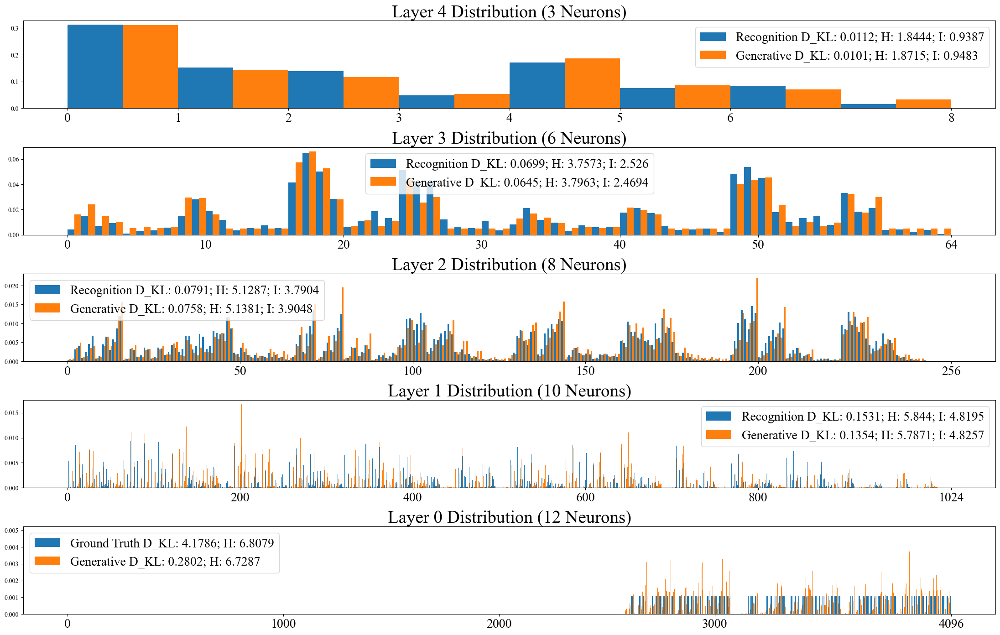
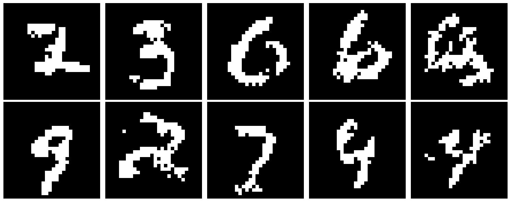
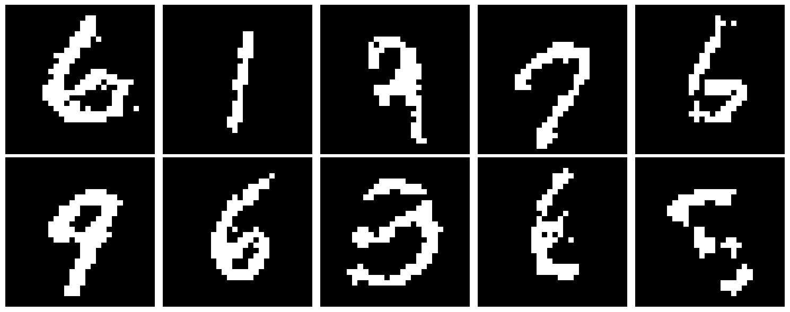

# Latent-Diversifying-Allocation-on-Mutual-Information-Maximization-in-the-Helmholtz-Machine

One of the author’s significant contributions is to address the latent state collapse in the Helmholtz machine when training with the wake-sleep algorithm by interleaving a mutual-information diversifying sampling scheme that promotes inter-layer information gains and communication efficiency, thus largely improving the model performance. This training scheme works as an auxiliary function empowering the original wake-sleep algorithm, while keeping its merits such as simplicity, local efficacy, and biological plausibility.

This work was first introduced in Chapter 2 of my [Ph.D. qualification writing](https://drive.google.com/file/d/1CNLO2FjDNW5RT0Zfc70ynZeVdm-KQsTH/view?pli=1), 2024, as an answer to the qualifying exam question by Prof. Sanjoy Dasgupta. It was later improved and evaluated on additional datasets, detailed in Chapter 2 of my [Ph.D. dissertation](https://www.proquest.com/openview/581cd124d0c14930d566ba9010cecd67/1?pq-origsite=gscholar&cbl=18750&diss=y), 2025. Here is a [pre-print](https://drive.google.com/file/d/1lj9kcIfja8ivIgsRGjZWSTAlB15Z5i3V/view?usp=sharing) of the first stage of this work.

<caption>
 Figure 1: Latent State Collapse in the Helmholtz Machine Training with the Wake-Sleep Algorithm. 
</caption>

 
 

When improved with the mutual information maximization algorithm:

<caption>
 Figure 2: Training Result with the Interleaved Mutual Information Maximization (MIM) Scheme. 
</caption>

 
 

Unlike the sampled instances, here is a record of the training dynamics of three algorithms:

<caption>
 Figure 3: Model performance on the vanilla wake-sleep algorithm, the interleaved MIM scheme, and the interleaved random perturbation. 
</caption>
 
 
This algorithm was tested on several synthetic datasets and demonstrated effectiveness. The simplified version, with substantially reduced computational complexity, was subsequently tested on the MNIST dataset and showed a noticeable improvement in generation quality.

<caption>
 Figure 4:  Generated handwritten digits with the wake-sleep algorithm. 
</caption>

<caption>
 Figure 5:  Generated handwritten digits with the interleaved mutual information maximization algorithm. 
</caption>
